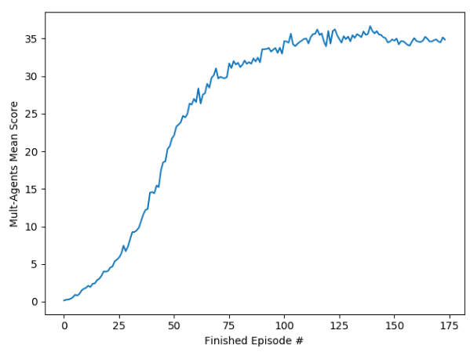
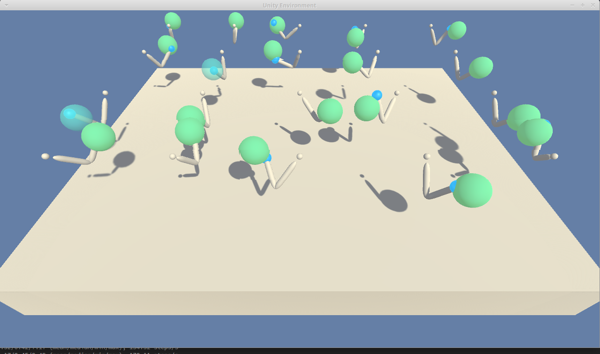

#### Learning Algorithms
**PPO actor-critic**
```
Choose t-max, step, 
create actor network, critic network and the ppo network.
for i in episodes (0.....10000)
    collect trajecty  (if t exceeds t-max or done)
    for i in surrgate_iteration:
        random sample batch training datas (s, a, r, s_n)
        pred = policy(s, a) and get new log_prob
        calculate actor loss
        calculate critic loss
        loss backward         
```

#### Hyper Parameters

| parameter   |      value | 
|----------|:-------------:|
| epsilon  |     0.2       | 
| beta     |     0.01      |
| discount rate | 0.99     |
| rollout length | 2048    |
| surrgate clip value | 0.2|
| surrgate iteration  | 10 |
| batch-size    |    64    |
| learning rate |   3e-4   |
| optimizer     |    Adam  |


#### Networks
* Actor Network two fully connected layer, with hidden layer 64.
* Critic Network two fully connected layer, with hidden layer 64.
* A fully Connected layer link Actor Network output and action entried.
* A fully Connected layer link Critic output and 1-dim output.


#### Results
I have tried PPO, PPO with actor-critic and AC2, only PPO with actor-critic can meets the requirement. The following is running detail of PPO with actor-critic. 

*  **PPO Actor-Ciritc**

    ```
        total steps 1, returns 0.16/0.00/0.00/0.91 (mean/median/min/max), 85.29 steps/s
        total steps 2, returns 0.26/0.19/0.00/1.24 (mean/median/min/max), 85.83 steps/s
        total steps 3, returns 0.29/0.24/0.00/1.23 (mean/median/min/max), 87.97 steps/s
        total steps 4, returns 0.39/0.21/0.00/1.95 (mean/median/min/max), 89.49 steps/s
        total steps 5, returns 0.57/0.58/0.00/1.40 (mean/median/min/max), 87.22 steps/s
        total steps 6, returns 0.91/0.75/0.00/3.20 (mean/median/min/max), 86.61 steps/s
        total steps 7, returns 0.81/0.71/0.00/1.87 (mean/median/min/max), 86.84 steps/s
        total steps 8, returns 1.04/0.99/0.33/2.20 (mean/median/min/max), 87.12 steps/s
        total steps 9, returns 1.50/1.44/0.14/3.52 (mean/median/min/max), 86.44 steps/s
        total steps 10, returns 1.72/1.65/0.00/3.98 (mean/median/min/max), 86.02 steps/s
        total steps 11, returns 1.84/1.81/0.38/4.21 (mean/median/min/max), 86.35 steps/s
        total steps 12, returns 2.13/2.06/0.66/5.61 (mean/median/min/max), 86.12 steps/s
        total steps 13, returns 1.94/1.90/0.23/4.30 (mean/median/min/max), 85.83 steps/s
        total steps 14, returns 2.39/2.45/0.80/4.36 (mean/median/min/max), 85.52 steps/s
        total steps 15, returns 2.43/2.45/0.94/4.32 (mean/median/min/max), 85.53 steps/s
        total steps 16, returns 2.86/2.69/0.94/5.63 (mean/median/min/max), 85.58 steps/s
        total steps 17, returns 3.05/2.90/1.08/5.62 (mean/median/min/max), 85.66 steps/s
        total steps 18, returns 3.44/3.26/0.86/8.11 (mean/median/min/max), 85.06 steps/s
        total steps 19, returns 4.02/3.98/1.84/6.23 (mean/median/min/max), 85.52 steps/s
        total steps 20, returns 3.99/4.04/1.23/7.77 (mean/median/min/max), 85.08 steps/s
        total steps 21, returns 4.08/4.03/1.37/7.04 (mean/median/min/max), 85.52 steps/s
        total steps 22, returns 4.54/4.64/1.31/8.41 (mean/median/min/max), 85.30 steps/s
        total steps 23, returns 4.68/4.39/1.40/9.96 (mean/median/min/max), 85.54 steps/s
        total steps 24, returns 5.35/5.55/1.91/9.40 (mean/median/min/max), 85.50 steps/s
        total steps 25, returns 5.59/5.81/1.74/7.77 (mean/median/min/max), 85.27 steps/s
        total steps 26, returns 5.87/5.95/2.72/9.72 (mean/median/min/max), 85.35 steps/s
        total steps 27, returns 6.39/6.37/1.69/10.05 (mean/median/min/max), 85.54 steps/s
        total steps 28, returns 7.46/7.71/2.03/12.40 (mean/median/min/max), 85.36 steps/s
        total steps 29, returns 6.71/6.91/3.50/10.36 (mean/median/min/max), 85.29 steps/s
        total steps 30, returns 7.30/6.92/4.42/11.30 (mean/median/min/max), 85.43 steps/s
        total steps 31, returns 8.29/8.03/3.45/13.19 (mean/median/min/max), 85.23 steps/s
        total steps 32, returns 9.24/8.62/5.24/13.67 (mean/median/min/max), 86.05 steps/s
        total steps 33, returns 9.27/9.27/2.50/14.08 (mean/median/min/max), 85.63 steps/s
        total steps 34, returns 9.48/9.53/4.75/14.09 (mean/median/min/max), 85.36 steps/s
        total steps 35, returns 9.84/9.61/5.00/15.76 (mean/median/min/max), 85.12 steps/s
        total steps 36, returns 10.75/10.75/4.76/16.51 (mean/median/min/max), 85.27 steps/s
        total steps 37, returns 11.59/11.82/4.64/15.91 (mean/median/min/max), 85.30 steps/s
        total steps 38, returns 12.20/12.19/5.95/17.41 (mean/median/min/max), 85.56 steps/s
        total steps 39, returns 12.34/12.50/7.06/18.35 (mean/median/min/max), 85.21 steps/s
        total steps 40, returns 14.48/14.27/9.75/21.60 (mean/median/min/max), 84.85 steps/s
        total steps 41, returns 14.59/14.96/7.02/22.47 (mean/median/min/max), 85.28 steps/s
        total steps 42, returns 14.40/14.67/6.00/19.96 (mean/median/min/max), 85.38 steps/s
        total steps 43, returns 15.44/15.00/9.89/36.32 (mean/median/min/max), 85.32 steps/s
        total steps 44, returns 15.24/15.39/8.66/24.52 (mean/median/min/max), 85.14 steps/s
        total steps 45, returns 17.45/18.01/8.83/23.70 (mean/median/min/max), 84.99 steps/s
        total steps 46, returns 18.53/18.81/6.48/25.90 (mean/median/min/max), 84.83 steps/s
        total steps 47, returns 18.66/18.45/11.16/23.66 (mean/median/min/max), 84.88 steps/s
        total steps 48, returns 20.28/20.15/11.85/28.17 (mean/median/min/max), 85.09 steps/s
        total steps 49, returns 20.67/20.93/11.78/26.07 (mean/median/min/max), 85.41 steps/s
        total steps 50, returns 21.70/21.50/12.74/27.75 (mean/median/min/max), 85.44 steps/s
        total steps 51, returns 22.13/22.54/10.89/28.10 (mean/median/min/max), 85.34 steps/s
        total steps 52, returns 23.27/23.30/13.11/31.19 (mean/median/min/max), 84.91 steps/s
        total steps 53, returns 23.54/23.48/10.87/34.49 (mean/median/min/max), 85.01 steps/s
        total steps 54, returns 23.84/24.65/12.14/30.00 (mean/median/min/max), 85.46 steps/s
        total steps 55, returns 24.71/24.82/16.47/32.22 (mean/median/min/max), 85.02 steps/s
        total steps 56, returns 24.51/25.22/13.24/32.30 (mean/median/min/max), 85.41 steps/s
        total steps 57, returns 24.94/25.57/17.09/31.17 (mean/median/min/max), 85.66 steps/s
        total steps 58, returns 26.36/26.77/14.73/36.46 (mean/median/min/max), 84.86 steps/s
        total steps 59, returns 26.21/26.62/17.81/32.31 (mean/median/min/max), 84.89 steps/s
        total steps 60, returns 26.97/28.40/17.08/39.37 (mean/median/min/max), 85.72 steps/s
        total steps 61, returns 26.53/27.33/14.81/33.52 (mean/median/min/max), 84.97 steps/s
        total steps 62, returns 28.37/28.14/20.52/38.63 (mean/median/min/max), 85.08 steps/s
        total steps 63, returns 26.35/27.11/16.01/31.99 (mean/median/min/max), 85.29 steps/s
        total steps 64, returns 27.52/27.89/17.91/36.32 (mean/median/min/max), 84.87 steps/s
        total steps 65, returns 27.71/27.76/20.44/35.63 (mean/median/min/max), 85.04 steps/s
        total steps 66, returns 28.97/29.16/20.16/36.52 (mean/median/min/max), 85.43 steps/s
        total steps 67, returns 28.45/28.68/18.63/34.93 (mean/median/min/max), 84.91 steps/s
        total steps 68, returns 29.77/30.76/18.62/35.63 (mean/median/min/max), 84.62 steps/s
        total steps 69, returns 30.10/29.79/23.63/38.04 (mean/median/min/max), 85.21 steps/s
        total steps 70, returns 31.03/31.27/25.26/38.32 (mean/median/min/max), 85.03 steps/s
        total steps 71, returns 29.68/30.23/20.52/33.68 (mean/median/min/max), 84.94 steps/s
        total steps 72, returns 29.90/30.01/21.18/34.03 (mean/median/min/max), 85.08 steps/s
        total steps 73, returns 29.76/30.50/16.20/35.54 (mean/median/min/max), 84.90 steps/s
        total steps 74, returns 29.69/29.72/21.30/36.43 (mean/median/min/max), 85.19 steps/s
        total steps 75, returns 29.88/30.51/22.65/36.47 (mean/median/min/max), 85.16 steps/s
        total steps 76, returns 31.69/31.58/24.04/39.15 (mean/median/min/max), 84.66 steps/s
        total steps 77, returns 31.08/31.46/24.02/38.80 (mean/median/min/max), 84.82 steps/s
        total steps 78, returns 31.99/32.30/24.86/36.34 (mean/median/min/max), 84.93 steps/s
        total steps 79, returns 31.53/31.89/24.30/36.44 (mean/median/min/max), 84.45 steps/s
        total steps 80, returns 31.77/31.52/22.78/38.64 (mean/median/min/max), 84.81 steps/s
        total steps 81, returns 31.18/31.54/24.05/35.19 (mean/median/min/max), 85.47 steps/s
        total steps 82, returns 31.50/32.18/23.95/36.25 (mean/median/min/max), 84.87 steps/s
        total steps 83, returns 32.06/32.71/22.81/38.20 (mean/median/min/max), 85.06 steps/s
        total steps 84, returns 31.62/32.52/21.82/38.24 (mean/median/min/max), 84.81 steps/s
        total steps 85, returns 31.86/32.27/21.89/35.25 (mean/median/min/max), 84.97 steps/s
        total steps 86, returns 31.63/32.18/20.72/36.19 (mean/median/min/max), 84.99 steps/s
        total steps 87, returns 32.35/32.38/26.90/35.85 (mean/median/min/max), 85.28 steps/s
        total steps 88, returns 31.93/32.43/23.48/38.58 (mean/median/min/max), 85.00 steps/s
        total steps 89, returns 32.46/32.80/26.24/37.43 (mean/median/min/max), 84.89 steps/s
        total steps 90, returns 31.82/32.13/23.79/37.45 (mean/median/min/max), 84.64 steps/s
        total steps 91, returns 33.56/34.09/26.19/38.99 (mean/median/min/max), 85.37 steps/s
        total steps 92, returns 33.57/33.54/27.17/39.14 (mean/median/min/max), 85.05 steps/s
        total steps 93, returns 33.61/34.02/27.25/38.31 (mean/median/min/max), 84.78 steps/s
        total steps 94, returns 33.73/34.41/22.63/38.61 (mean/median/min/max), 84.71 steps/s
        total steps 95, returns 33.25/34.02/21.08/38.54 (mean/median/min/max), 85.06 steps/s
        total steps 96, returns 33.51/34.28/22.50/38.96 (mean/median/min/max), 84.97 steps/s
        total steps 97, returns 33.74/34.20/22.36/37.71 (mean/median/min/max), 85.21 steps/s
        total steps 98, returns 33.08/33.92/22.83/38.87 (mean/median/min/max), 85.40 steps/s
        total steps 99, returns 33.77/34.88/19.33/38.89 (mean/median/min/max), 84.91 steps/s
        total steps 100, returns 32.99/33.77/25.16/39.50 (mean/median/min/max), 84.94 steps/s
        total steps 101, returns 34.65/35.50/25.37/38.40 (mean/median/min/max), 84.87 steps/s
        total steps 102, returns 34.59/35.18/27.96/38.63 (mean/median/min/max), 85.08 steps/s
        total steps 103, returns 34.44/35.14/23.79/38.88 (mean/median/min/max), 84.96 steps/s
        total steps 104, returns 35.63/36.42/24.34/39.18 (mean/median/min/max), 85.09 steps/s
        total steps 105, returns 34.22/35.35/18.61/39.08 (mean/median/min/max), 85.03 steps/s
        total steps 106, returns 33.98/35.78/17.62/38.38 (mean/median/min/max), 85.13 steps/s
        total steps 107, returns 34.29/34.64/26.05/38.91 (mean/median/min/max), 84.80 steps/s
        total steps 108, returns 34.53/35.35/26.69/39.08 (mean/median/min/max), 84.84 steps/s
        total steps 109, returns 34.73/35.78/22.85/38.40 (mean/median/min/max), 85.05 steps/s
        total steps 110, returns 34.95/36.65/22.91/39.42 (mean/median/min/max), 85.02 steps/s
        total steps 111, returns 34.99/36.06/26.42/39.47 (mean/median/min/max), 84.94 steps/s
        total steps 112, returns 34.34/35.64/24.18/38.81 (mean/median/min/max), 85.19 steps/s
        total steps 113, returns 35.17/35.79/25.23/39.20 (mean/median/min/max), 84.69 steps/s
        total steps 114, returns 35.57/36.57/24.03/39.35 (mean/median/min/max), 85.08 steps/s
        total steps 115, returns 35.62/36.98/25.00/38.91 (mean/median/min/max), 85.63 steps/s
        total steps 116, returns 36.19/37.16/25.11/39.41 (mean/median/min/max), 84.84 steps/s
        total steps 117, returns 35.46/36.67/25.46/39.43 (mean/median/min/max), 85.04 steps/s
        total steps 118, returns 35.67/37.00/19.98/39.54 (mean/median/min/max), 85.07 steps/s
        total steps 119, returns 34.62/36.20/19.27/39.53 (mean/median/min/max), 85.10 steps/s
        total steps 120, returns 33.96/36.47/20.62/39.47 (mean/median/min/max), 84.91 steps/s
        total steps 121, returns 35.98/36.85/28.97/39.36 (mean/median/min/max), 84.53 steps/s
        total steps 122, returns 34.32/35.49/24.72/39.25 (mean/median/min/max), 85.31 steps/s
        total steps 123, returns 35.97/37.35/26.91/39.48 (mean/median/min/max), 85.10 steps/s
        total steps 124, returns 36.21/36.92/30.30/38.81 (mean/median/min/max), 84.78 steps/s
        total steps 125, returns 35.43/36.47/27.44/38.95 (mean/median/min/max), 84.71 steps/s
        total steps 126, returns 34.93/35.47/28.32/38.92 (mean/median/min/max), 84.95 steps/s
        total steps 127, returns 34.44/35.22/24.90/39.22 (mean/median/min/max), 85.01 steps/s
        total steps 128, returns 35.31/36.68/26.00/39.36 (mean/median/min/max), 84.87 steps/s
        total steps 129, returns 34.91/35.64/24.48/38.64 (mean/median/min/max), 84.84 steps/s
        total steps 130, returns 35.26/36.72/22.78/38.42 (mean/median/min/max), 84.73 steps/s
        total steps 131, returns 34.62/35.27/25.87/38.26 (mean/median/min/max), 84.89 steps/s
        total steps 132, returns 35.45/36.04/27.67/39.19 (mean/median/min/max), 85.11 steps/s
        total steps 133, returns 35.07/34.89/26.00/39.04 (mean/median/min/max), 85.37 steps/s
        total steps 134, returns 35.58/36.86/27.56/39.12 (mean/median/min/max), 85.25 steps/s
        total steps 135, returns 35.42/36.12/24.71/39.38 (mean/median/min/max), 85.32 steps/s
        total steps 136, returns 35.16/35.96/27.59/38.49 (mean/median/min/max), 85.08 steps/s
        total steps 137, returns 35.92/36.50/29.03/39.15 (mean/median/min/max), 84.69 steps/s
        total steps 138, returns 35.48/35.66/30.58/38.84 (mean/median/min/max), 84.76 steps/s
        total steps 139, returns 35.60/36.57/27.32/38.48 (mean/median/min/max), 84.89 steps/s
        total steps 140, returns 36.64/37.39/32.98/39.41 (mean/median/min/max), 84.94 steps/s
        total steps 141, returns 36.00/36.33/30.29/38.91 (mean/median/min/max), 84.71 steps/s
        total steps 142, returns 35.67/36.07/29.08/39.11 (mean/median/min/max), 84.97 steps/s
        total steps 143, returns 35.97/36.51/28.87/39.17 (mean/median/min/max), 84.85 steps/s
        total steps 144, returns 35.54/36.32/29.84/37.85 (mean/median/min/max), 84.54 steps/s
        total steps 145, returns 35.46/35.28/31.14/38.87 (mean/median/min/max), 84.86 steps/s
        total steps 146, returns 35.17/36.22/25.58/38.23 (mean/median/min/max), 84.77 steps/s
        total steps 147, returns 35.05/35.71/25.24/38.98 (mean/median/min/max), 84.97 steps/s
        total steps 148, returns 34.47/34.75/28.15/38.17 (mean/median/min/max), 84.84 steps/s
        total steps 149, returns 34.58/35.03/28.60/38.12 (mean/median/min/max), 84.86 steps/s
        total steps 150, returns 34.88/35.29/26.61/37.91 (mean/median/min/max), 85.01 steps/s
        total steps 151, returns 34.70/35.42/26.51/38.61 (mean/median/min/max), 84.79 steps/s
        total steps 152, returns 34.99/35.26/27.74/38.51 (mean/median/min/max), 85.03 steps/s
        total steps 153, returns 34.21/35.13/24.79/39.00 (mean/median/min/max), 84.98 steps/s
        total steps 154, returns 34.65/35.27/28.47/38.53 (mean/median/min/max), 85.17 steps/s
        total steps 155, returns 34.62/34.58/27.35/38.85 (mean/median/min/max), 84.89 steps/s
        total steps 156, returns 34.40/34.56/26.98/38.03 (mean/median/min/max), 85.36 steps/s
        total steps 157, returns 34.15/34.80/26.20/38.47 (mean/median/min/max), 85.00 steps/s
        total steps 158, returns 34.04/34.45/22.29/38.79 (mean/median/min/max), 84.94 steps/s
        total steps 159, returns 34.60/35.05/26.49/37.70 (mean/median/min/max), 84.88 steps/s
        total steps 160, returns 35.05/35.24/28.04/38.97 (mean/median/min/max), 85.13 steps/s
        total steps 161, returns 34.68/34.87/29.52/38.40 (mean/median/min/max), 85.20 steps/s
        total steps 162, returns 34.57/34.60/28.70/38.51 (mean/median/min/max), 85.38 steps/s
        total steps 163, returns 34.53/34.62/30.72/38.29 (mean/median/min/max), 84.87 steps/s
        total steps 164, returns 34.72/35.43/26.43/38.20 (mean/median/min/max), 84.72 steps/s
        total steps 165, returns 35.23/35.80/29.55/39.35 (mean/median/min/max), 85.32 steps/s
        total steps 166, returns 34.97/35.42/27.86/38.54 (mean/median/min/max), 84.69 steps/s
        total steps 167, returns 34.60/34.99/28.62/38.11 (mean/median/min/max), 85.13 steps/s
        total steps 168, returns 34.60/34.86/26.23/38.50 (mean/median/min/max), 85.25 steps/s
        total steps 169, returns 34.77/34.92/27.88/38.30 (mean/median/min/max), 85.19 steps/s
        total steps 170, returns 34.89/35.19/28.52/38.59 (mean/median/min/max), 85.11 steps/s
        total steps 171, returns 34.58/35.27/29.85/39.14 (mean/median/min/max), 85.46 steps/s
        total steps 172, returns 34.49/35.24/26.26/38.06 (mean/median/min/max), 84.84 steps/s
        total steps 173, returns 35.14/35.14/29.04/39.13 (mean/median/min/max), 84.85 steps/s
        total steps 174, returns 34.84/35.33/27.89/38.50 (mean/median/min/max), 85.16 steps/s
        Reacher Environment solved!
    ```
    
    
    Test Result
    
    


#### Future Ideas
* To test different hyper parameter combination in order to meets the project requirements using algorithm ac2.
* Implement DDPG
* Implement SAC
* Implement SAC with automatically adujsted temperature